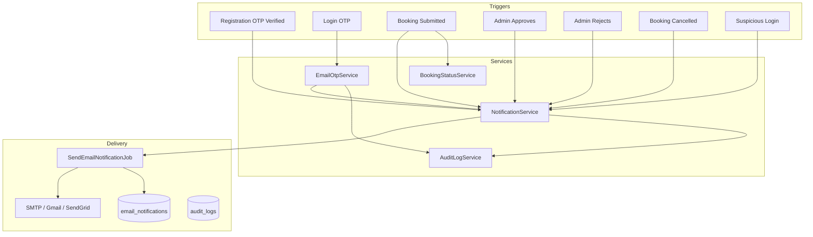

# Email Notification & OTP Authentication System

Complete documentation for the integrated email notification, OTP authentication, and booking management module.

## Database Schema

| Table | Purpose |
|-------|---------|
| `users` | Registered accounts |
| `otp_verifications` | Active OTP records (hashed codes, expiry, lockout) |
| `bookings` | Hiking permit booking requests |
| `booking_status_history` | Audit trail of status changes |
| `email_notifications` | Delivery log for all outbound emails |
| `email_templates` | Template metadata (subject, view, key) |
| `audit_logs` | OTP, auth, and security event logs |

### Setup

```bash
php artisan migrate
php artisan db:seed --class=EmailTemplateSeeder
```

### Queue worker (required for non-OTP emails)

```bash
php artisan queue:work
```

OTP emails are sent **immediately** (synchronous). Booking **approval** and **rejection** emails are also sent **immediately** so visitors are notified without a queue worker. All other notifications are **queued** with 3 retries (60s, 5min, 15min backoff).

---

## Email Types

### A. Account Creation (`account_created`)
- **Trigger:** Successful registration OTP verification
- **Subject:** Welcome! Your Account Has Been Successfully Created
- **Includes:** Name, email, creation date/time, system name, login URL, security reminder

### B. OTP Verification (`otp_verification`)
- **Trigger:** Login or registration
- **Subject:** Your Verification Code
- **Content:** `Your One-Time Password (OTP) is: {code}. This code will expire in 5 minutes.`
- **Rules:** 5 min expiry, 60s resend cooldown, max 5 attempts

### C. Booking Submitted (`booking_submitted`)
- **Trigger:** User submits booking
- **Subject:** Booking Request Received
- **Status:** Pending Review

### D. Booking Approved (`booking_approved`)
- **Trigger:** Admin approves booking
- **Subject:** Booking Request Approved

### E. Booking Rejected (`booking_rejected`)
- **Trigger:** Admin rejects booking
- **Subject:** Booking Request Rejected

### F. Admin Notifications
| Template | Trigger |
|----------|---------|
| `admin_new_account` | New visitor registration |
| `admin_booking_submitted` | New booking request |
| `admin_booking_cancelled` | Visitor cancels booking |
| `admin_suspicious_login` | 5+ failed login attempts |

---

## Architecture



---

## API Endpoints

### OTP (public)
| Method | Endpoint | Description |
|--------|----------|-------------|
| POST | `/api/otp/send` | Send OTP |
| POST | `/api/otp/verify` | Verify OTP |
| POST | `/api/otp/resend` | Resend OTP |

### Admin notifications (auth + admin)
| Method | Endpoint | Description |
|--------|----------|-------------|
| GET | `/api/admin/notifications/emails` | Email delivery history |
| GET | `/api/admin/notifications/audit-logs` | OTP & security audit logs |

Query params: `status`, `template`, `category`, `event`

---

## Security & Error Handling

| Mechanism | Implementation |
|-----------|----------------|
| OTP hashing | Bcrypt in `otp_verifications.otp_code` |
| Brute-force | 5 attempts → 15 min lockout |
| Rate limiting | Route throttle + `RateLimiter` |
| Email retries | 3 attempts with exponential backoff |
| Failure logging | `email_notifications.status = failed` + `error_message` |
| Audit trail | `audit_logs` for OTP and suspicious login |
| Session security | Regenerate on successful OTP verify |

---

## SMTP Configuration

```env
MAIL_MAILER=smtp
MAIL_HOST=smtp.gmail.com
MAIL_PORT=587
MAIL_USERNAME=your-email@gmail.com
MAIL_PASSWORD=your-app-password
MAIL_FROM_ADDRESS=your-email@gmail.com
MAIL_FROM_NAME="${APP_NAME}"
QUEUE_CONNECTION=database
```

Supports Gmail, Outlook, SendGrid, Mailgun, and Amazon SES via Laravel mail config.

---

## File Reference

| Component | Path |
|-----------|------|
| Notification service | `app/Services/NotificationService.php` |
| Audit log service | `app/Services/AuditLogService.php` |
| Booking status service | `app/Services/BookingStatusService.php` |
| Email queue job | `app/Jobs/SendEmailNotificationJob.php` |
| Email templates (Blade) | `resources/views/emails/` |
| Mailable classes | `app/Mail/` |
| Admin API | `app/Http/Controllers/Admin/NotificationController.php` |

---

## Testing

```bash
php artisan test --filter=EmailOtpAuthenticationTest
```

| Scenario | Expected |
|----------|----------|
| Register + verify OTP | Welcome email queued, admins notified |
| Login + verify OTP | User authenticated |
| Submit booking | User + admin confirmation emails queued |
| Admin approves | Approval email queued |
| Admin rejects | Rejection email with reason |
| Cancel booking | Admin cancellation alert |
| 5 failed logins | Admin security alert + audit log |
