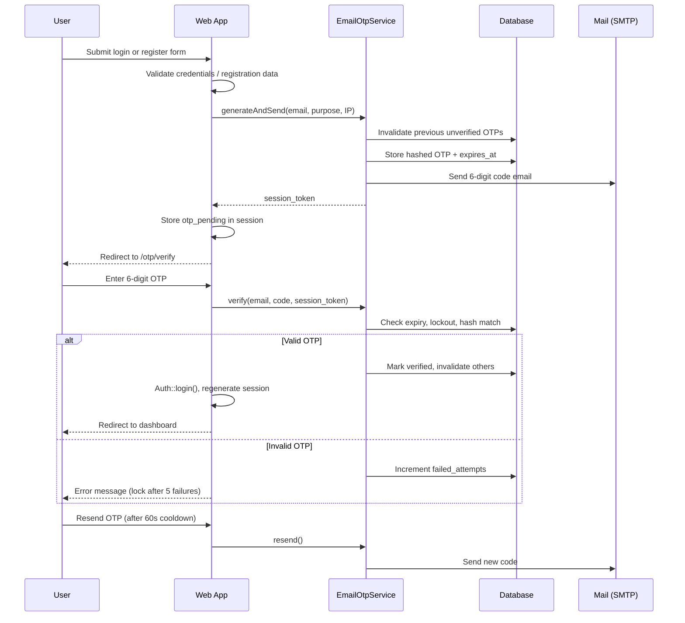

# Email OTP Authentication Module

This document describes the Email OTP (One-Time Password) authentication flow integrated into the Aborlan Municipality permit booking system.

## Database Structure

Table: `email_otps`

| Column | Type | Description |
|--------|------|-------------|
| `id` | bigint | Primary key |
| `email` | string(160) | Registered email address (indexed) |
| `otp_code` | string | Bcrypt hash of the 6-digit OTP (never stored in plaintext) |
| `purpose` | string(32) | `login` or `register` |
| `session_token` | string(64) | Unique token linking OTP to the pending auth session |
| `failed_attempts` | tinyint | Count of incorrect verification attempts |
| `locked_until` | timestamp | Temporary lockout expiry after max failed attempts |
| `last_sent_at` | timestamp | Used for 60-second resend cooldown |
| `is_verified` | boolean | Whether the OTP has been successfully used |
| `ip_address` | string(45) | Client IP at generation time |
| `expires_at` | timestamp | OTP expiry (5 minutes from creation) |
| `created_at` / `updated_at` | timestamps | Audit timestamps |

Run the migration:

```bash
php artisan migrate
```

## System Workflow



## API Endpoints

All API routes are prefixed with `/api` and return JSON.

| Method | Endpoint | Auth | Description |
|--------|----------|------|-------------|
| `POST` | `/api/otp/send` | Guest | Send OTP to a registered email |
| `POST` | `/api/otp/verify` | Pending session | Verify submitted OTP code |
| `POST` | `/api/otp/resend` | Pending session | Resend OTP (60s cooldown) |

### Example: Send OTP

```http
POST /api/otp/send
Content-Type: application/json

{
  "email": "visitor@example.com",
  "purpose": "login"
}
```

### Example: Verify OTP

```http
POST /api/otp/verify
Content-Type: application/json
Cookie: laravel_session=...

{
  "otp_code": "123456"
}
```

## Web Routes

| Method | Route | Description |
|--------|-------|-------------|
| `GET` | `/otp/verify` | Verification page |
| `POST` | `/otp/verify` | Submit OTP |
| `POST` | `/otp/resend` | Resend OTP |
| `POST` | `/otp/cancel` | Cancel and return to login |

Login (`POST /login`) and registration (`POST /register`) now redirect to the OTP verification step instead of signing the user in immediately.

## Security Implementation

| Measure | Implementation |
|---------|----------------|
| OTP storage | Bcrypt hash via `Hash::make()` |
| Expiration | 5 minutes (`config/otp.php`) |
| Brute-force protection | Max 5 failed attempts → 15-minute lockout |
| Resend cooldown | 60 seconds between sends |
| Rate limiting | Laravel `RateLimiter` + route `throttle` middleware |
| Session security | `session()->regenerate()` after successful verification |
| Input validation | Email format, 6-digit numeric OTP regex |
| Logging | `Log::info` / `Log::warning` for generation, verification, lockouts |
| Email masking | Partially masked in logs and UI |

## Configuration

Edit `config/otp.php` or publish values to `.env` as needed:

- `expiry_minutes` — default `5`
- `max_attempts` — default `5`
- `lockout_minutes` — default `15`
- `resend_cooldown_seconds` — default `60`

## Mail Setup

Configure SMTP in `.env`:

```
MAIL_MAILER=smtp
MAIL_HOST=smtp.gmail.com
MAIL_PORT=587
MAIL_USERNAME=your-email@gmail.com
MAIL_PASSWORD=your-app-password
MAIL_FROM_ADDRESS=your-email@gmail.com
MAIL_FROM_NAME="${APP_NAME}"
```

## Testing Scenarios

| # | Scenario | Expected Result |
|---|----------|-----------------|
| 1 | Valid login credentials | OTP email sent, redirect to verify page, user not authenticated yet |
| 2 | Correct OTP entered | User authenticated, session regenerated, redirect to dashboard |
| 3 | Incorrect OTP | Error shown, `failed_attempts` incremented |
| 4 | 5 incorrect OTPs | Verification locked for 15 minutes |
| 5 | Expired OTP (>5 min) | Error: code expired, prompt to resend |
| 6 | Resend within 60s | Blocked with cooldown message |
| 7 | Resend after cooldown | New OTP sent, previous codes invalidated |
| 8 | Registration flow | Account created, OTP required before welcome email and access |
| 9 | Rate-limited OTP requests | HTTP 429 / error after limit exceeded |
| 10 | Cancel verification | Session cleared, return to login |

Run automated tests:

```bash
php artisan test --filter=EmailOtpAuthenticationTest
```

## File Reference

| Component | Path |
|-----------|------|
| Migration | `database/migrations/2026_06_17_000000_create_email_otps_table.php` |
| Model | `app/Models/EmailOtp.php` |
| Service | `app/Services/EmailOtpService.php` |
| Controllers | `app/Http/Controllers/Auth/OtpController.php`, `AuthController.php` |
| Middleware | `app/Http/Middleware/EnsureOtpPending.php` |
| Mailable | `app/Mail/OtpVerification.php` |
| Email template | `resources/views/emails/otp-verification.blade.php` |
| Verification UI | `resources/views/auth/verify-otp.blade.php` |
| Frontend JS | `public/js/otp-verify.js` |
| Config | `config/otp.php` |
| Tests | `tests/Feature/EmailOtpAuthenticationTest.php` |
