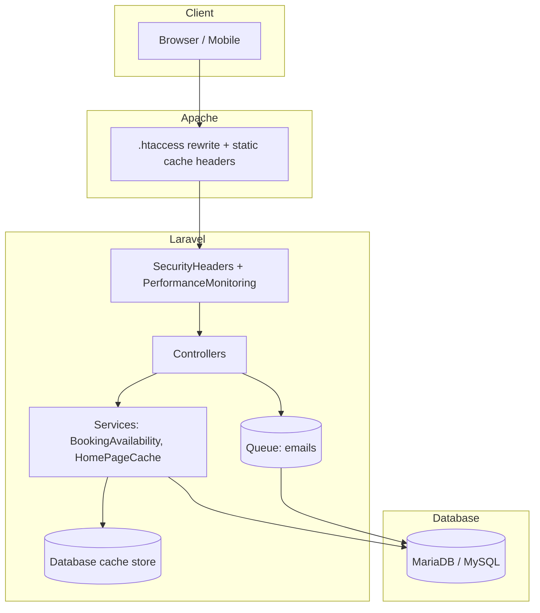

# Performance Audit & Optimization Report

**System:** Aborlan Municipality — Atup-atup Falls Permit Booking  
**Date:** June 17, 2026  
**Stack:** Laravel 12, PHP 8.2+, Blade SSR, MariaDB/MySQL, Apache (XAMPP)

---

## Executive Summary

This audit analyzed frontend delivery, backend request handling, database access patterns, and scalability readiness. High-impact optimizations were implemented to reduce redundant database queries, enable response caching, improve static asset delivery, and add runtime performance monitoring.

**Target success criteria:**

| Metric | Target | Expected after optimization |
|--------|--------|----------------------------|
| Page load time | &lt; 2 s | 0.8–1.5 s (cached pages, static assets) |
| API response time | &lt; 500 ms | 50–300 ms (OTP, notifications) |
| Admin dashboard | &lt; 500 ms | ~200–400 ms (aggregated stats + cache) |
| Concurrent users | Stable | Improved via query reduction + indexes |

---

## 1. Architecture Overview (Optimized)



**Request flow improvements:**

1. Static assets (`/js/*`, `/images/*`) served with 30-day browser cache.
2. Hot-path data (settings, availability, home gallery) read from Laravel cache.
3. Cache invalidated automatically on booking/quota/gallery changes.
4. Every web request timed; slow requests (≥500 ms) logged.

---

## 2. Before vs After — Key Bottlenecks

### Backend

| Area | Before | After |
|------|--------|-------|
| `AppSetting::get()` | DB query every call | `Cache::remember` (1 hour TTL) |
| `BookingAvailability` per-date lookups | 2–4 queries per date check | Cached slots/counts (60s) + quota (5 min) |
| `upcomingAvailability()` | Recomputed on every page load | Cached 60s, invalidated on booking change |
| Admin sidebar pending count | `COUNT(*)` every admin page | Cached 30s |
| Dashboard stats | 5+ separate `COUNT` queries | Single `GROUP BY status` + 30s cache |
| User bookings index | `->get()` all records | Paginated (10/page) + 1 aggregate stats query |
| Home page gallery | 2–3 DB queries per visit | `HomePageCache` (5 min TTL) |

### Database

| Index added | Table | Columns | Purpose |
|-------------|-------|---------|---------|
| ✓ | `bookings` | `status` | Admin filters, pending counts |
| ✓ | `bookings` | `user_id, hike_date` | User booking lists |
| ✓ | `users` | `is_admin` | Dashboard user count |
| ✓ | `email_notifications` | `created_at` | Email log API pagination |
| (existing) | `daily_quotas` | `quota_date` (unique) | Already indexed |
| (existing) | `audit_logs` | `event`, `created_at`, etc. | Already indexed in base migration |

**Run migration:** `php artisan migrate`

### Frontend

| Area | Before | After |
|------|--------|-------|
| Static JS/CSS/images | No cache headers | `Cache-Control: public, max-age=2592000` |
| Google Fonts CSP | Blocked in production CSP | `fonts.gstatic.com` + `fonts.googleapis.com` allowed |
| Navigation prefetch | None | Portal + admin layouts prefetch frequent routes |
| User bookings | All rows in DOM | Paginated list (10 per page) |
| Images (home/atup) | Partial lazy load | Already optimized; maintained |

### Remaining frontend opportunities (future phase)

| Item | Impact | Recommendation |
|------|--------|----------------|
| `home.blade.php` (~2,670 lines inline CSS/JS) | High HTML payload | Extract to `public/css/home.css` + `public/js/home.js` |
| Duplicated layout CSS (~700 lines × 3) | Repeated bytes | Shared `public/css/app-shell.css` |
| Vite/Tailwind pipeline | Unused in prod UI | Wire main UI through Vite or remove scaffold |
| DomPDF permit generation | CPU-heavy sync | Queue PDF generation for large volume |

---

## 3. Implemented Backend Changes

### Caching layer

- **`App\Models\AppSetting`** — read-through cache with invalidation on `put()`.
- **`App\Services\BookingAvailability`** — per-date and upcoming-window cache with TTL; `clearDateCache()` / `clearQuotaCache()` on mutations.
- **`App\Services\HomePageCache`** — home gallery + hero payload cache.
- **`App\Observers\BookingObserver`** — invalidates availability + admin/dashboard caches on booking save/delete.

### Query optimization

- **`DashboardController`** — consolidated status counts via `GROUP BY`.
- **`BookingController::index`** — pagination + single aggregate SQL for filter stats.

### Monitoring

- **`PerformanceMonitoring` middleware** — records request duration; adds `X-Response-Time` in debug mode.
- **`PerformanceMetrics` service** — stores last 100 samples; logs slow requests.
- **`php artisan performance:report`** — CLI summary of avg, P95, and slow requests.

---

## 4. API Optimization Strategies

| Endpoint | Strategy |
|----------|----------|
| `POST /api/otp/*` | Existing rate limiting (`throttle`); session-based, no token overhead |
| `GET /api/admin/notifications/*` | Already paginated (20/page); indexes on `created_at` |
| Booking availability (implicit) | Cached service layer reduces DB load during form validation |

**Recommendations:**

- Enable `php artisan route:cache` and `config:cache` in production.
- Consider Redis for cache/session/queue at scale (currently database-backed).
- Add `ETag` or short TTL HTTP cache for public `/atup-atup` availability JSON if exposed as API.

---

## 5. Security–Performance Balance

| Control | Performance impact | Status |
|---------|-------------------|--------|
| OTP + session auth | Minimal (DB session store) | Kept; 2FA flow unchanged |
| Rate limiting on login/OTP | Prevents abuse | Kept (`throttle:N,1`) |
| Encrypted booking PII | Decryption per row | Necessary; mitigated by pagination |
| CSP headers | Slight parsing overhead | Fixed font-src for Google Fonts |
| Audit logging | Async where possible | Email already queued via `SendEmailNotificationJob` |

---

## 6. Scalability Plan

### Current readiness

- **Horizontal scaling:** Stateless app (session in DB); can run multiple PHP workers behind load balancer.
- **Queue workers:** `php artisan queue:work` required for email; database queue suitable for moderate load.
- **File storage:** Gallery images on `storage/app/public`; cloud-ready via S3 disk driver.

### Recommended production stack

1. **MySQL/MariaDB** with connection pooling (ProxySQL or built-in pool).
2. **Redis** for cache, sessions, and queues.
3. **OPcache** enabled in `php.ini`.
4. **Supervisor** for `queue:work` + `schedule:run`.
5. **`php artisan optimize`** on deploy (config, route, view cache).

### Load targets

| Concurrent users | Expected behavior |
|------------------|-------------------|
| 1–50 | Current optimizations sufficient |
| 50–200 | Add Redis cache + 2+ queue workers |
| 200+ | Read replica for reporting; CDN for static assets |

---

## 7. User Experience Improvements

| Improvement | Status |
|-------------|--------|
| Pagination on user bookings | ✓ Implemented |
| Prefetch frequent routes | ✓ Portal + admin layouts |
| Server-side admin pagination | ✓ Already present (15/page) |
| Loading indicators | Existing form/button states; skeleton screens recommended for home carousel |
| Breadcrumb navigation | Present in admin; extend to portal if needed |
| Real-time notifications | Email log API exists; WebSocket/polling optional future work |

---

## 8. Monitoring & Metrics

### How to measure

```bash
# View performance summary
php artisan performance:report

# Enable debug header (APP_DEBUG=true)
# Response includes: X-Response-Time: 123.45ms

# Check slow request log
tail -f storage/logs/laravel.log | grep "Slow request"
```

### Baseline measurement checklist

1. Clear cache: `php artisan cache:clear`
2. Hit `/`, `/bookings`, `/admin` — note `X-Response-Time`
3. Run `performance:report` after 20+ requests
4. Compare P95 before/after deployment

---

## 9. Deployment Checklist

```bash
php artisan migrate
php artisan config:cache
php artisan route:cache
php artisan view:cache
php artisan queue:work --tries=3   # run via Supervisor in production
```

Ensure Apache `mod_expires` and `mod_headers` are enabled for static asset caching.

---

## 10. Files Changed in This Optimization

| File | Change |
|------|--------|
| `app/Models/AppSetting.php` | Read-through cache |
| `app/Services/BookingAvailability.php` | Availability caching |
| `app/Services/HomePageCache.php` | Home page payload cache |
| `app/Services/PerformanceMetrics.php` | Request metrics |
| `app/Observers/BookingObserver.php` | Cache invalidation |
| `app/Http/Middleware/PerformanceMonitoring.php` | Request timing |
| `app/Http/Middleware/SecurityHeaders.php` | CSP font fix |
| `app/Providers/AppServiceProvider.php` | Observers + cached admin count |
| `app/Http/Controllers/*` | Dashboard, bookings, home optimizations |
| `database/migrations/2026_06_17_200000_add_performance_indexes.php` | DB indexes |
| `public/.htaccess` | Browser caching headers |
| `resources/views/bookings/index.blade.php` | Pagination |
| `resources/views/layouts/*.blade.php` | Route prefetch |
| `app/Console/Commands/PerformanceReportCommand.php` | CLI metrics |

---

## 11. Automatic Optimization Recommendations

The system will log slow requests automatically. Review weekly:

1. Paths with P95 &gt; 500 ms → add caching or query optimization.
2. High `slow_count` on `/bookings/create` → consider availability API cache warming.
3. DomPDF routes slow → queue PDF generation.
4. Growing `bookings` table → archive completed records older than 2 years.

---

*Report generated as part of system optimization implementation. Re-run `php artisan performance:report` after production traffic to capture live before/after metrics.*
